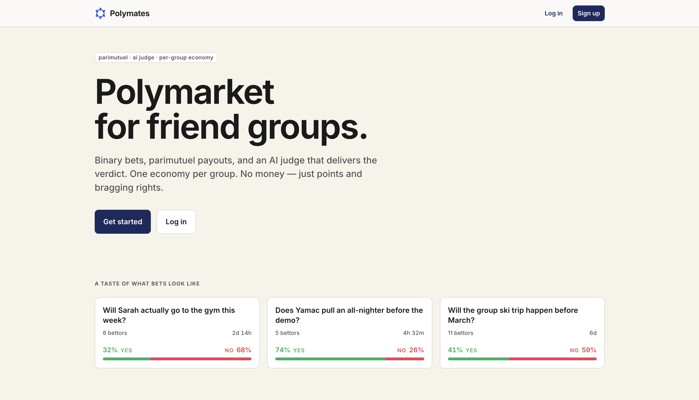
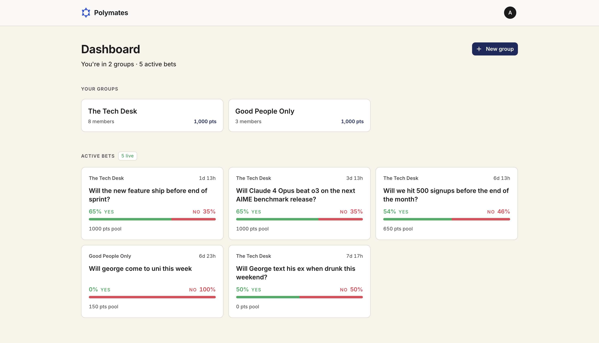
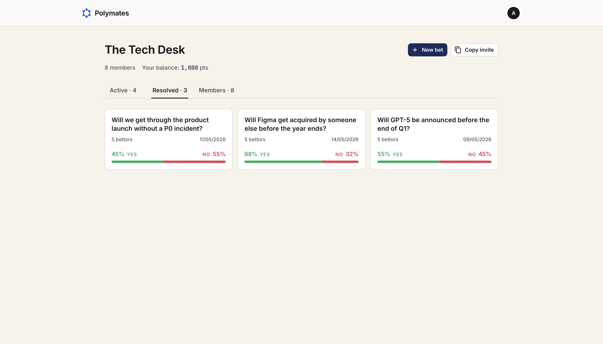
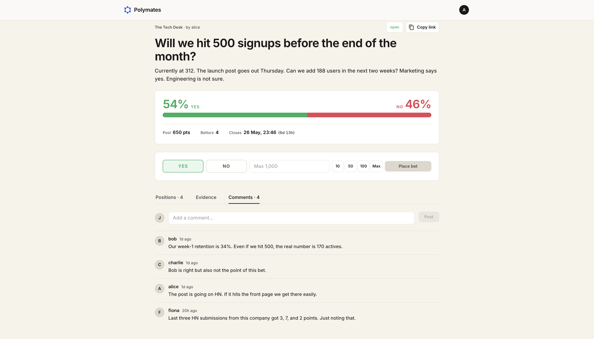
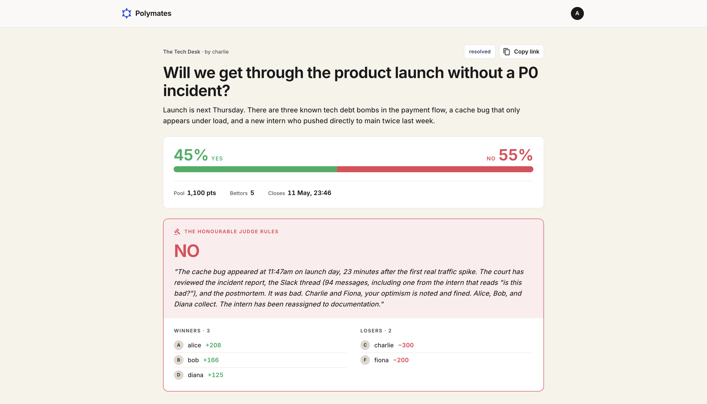

# Polymates

> *Polymarket for friend groups. Binary bets, parimutuel payouts, an AI judge.*

Polymates is a social betting app for friend groups. Members create binary (Yes/No) bets, stake virtual points, submit evidence before the deadline, and an AI arbiter delivers a humorous, courtroom-themed verdict.

---

## Key Features

- **Private friend groups** — Create a group, share an invite link, and bet only with people you know. Each group is its own economy with its own points balances and leaderboard.
- **Binary bets with parimutuel payouts** — Yes/No questions only. The losing pool is distributed proportionally among winners based on stake size.
- **Per-group points economy** — Every member starts with 1000 points on joining a group. Points are scoped per-group so balances and rankings stay self-contained.
- **Evidence submission** — Upload images, PDFs, and captions before the deadline to make your case. Client-side image compression keeps uploads fast.
- **AI Arbiter (The Honourable Judge)** — A Claude-powered Supabase Edge Function reviews the bet, evidence, and context to deliver a forced YES/NO verdict with a ≤120 word sarcastic ruling.
- **Automatic resolution** — Bets auto-close at the deadline and the arbiter pays out winners. A `pg_cron` job resolves overdue bets even when no client is open.
- **Shareable bet links** — Copy a share link for any bet. Non-members see a preview and a one-click "join group & view bet" flow.
- **Live updates** — Supabase Realtime pushes the verdict to open bet pages the moment it lands.
- **Courthouse-themed UI** — Gavel icons, judge headers, and a serious-but-silly tone throughout.

---

## Tech Stack

| Layer | Choice |
|---|---|
| Frontend | React + MUI + Vite |
| Language | TypeScript |
| Backend | Supabase (direct client) |
| Database | Supabase Postgres (RLS + RPCs) |
| Auth | Supabase Auth |
| Storage | Supabase Storage (evidence files) |
| Arbiter | Supabase Edge Function → Anthropic API (Claude) |
| Scheduling | `pg_cron` + `pg_net` |
| Validation | Zod |
| Code quality | ESLint + Prettier |
| Deployment | Vercel (frontend) + Supabase (backend) |

---

## Screenshots

### Landing page


### Dashboard


### Group page


### Bet page — wager + comments


### Verdict — The Honourable Judge rules


---

## Getting Started

Try the live app: **[polymates.vercel.app](https://polymates.vercel.app)**

Or run locally:

```bash
npm install
npm run dev
```

Set up a `.env` file with your Supabase URL and anon key. Run the SQL migrations in `backend/migrations/` against your Supabase project, and deploy the `resolve-bet` edge function with the `ANTHROPIC_API_KEY` secret set.
